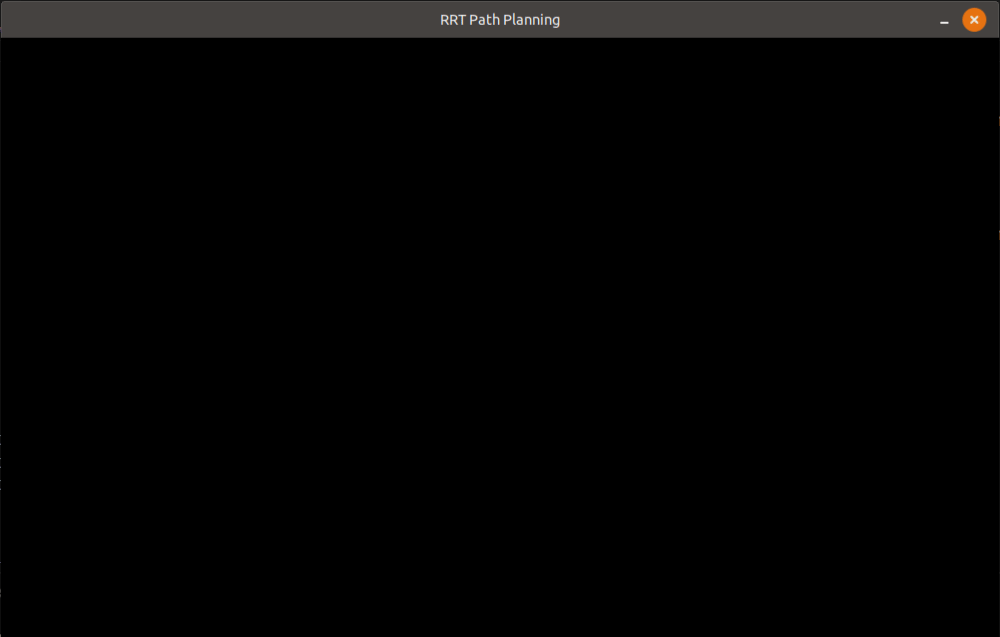

# RRT/RRT*

Python implementation of the RRT/RRT* algorithms using pygame. 

## Prerequisites
- [pygame](https://www.pygame.org/wiki/GettingStarted)

## Demo
Just run `python3 RRT.py` from terminal.

- Max Iterations: 500
- 2% Goal Bias
- Algorithm stops once goal state is reached.

## Authors
- [Devansh Dhrafani](https://github.com/devanshdhrafani)

## To-Do
- [ ] Implement [Shortest Path Finding algorithm](https://en.wikipedia.org/wiki/Dijkstra%27s_algorithm) to find optimal path between start and goal. 
- [ ] Implement RRT* Algorithm

## References
- LaValle, Steven M. "[Rapidly-exploring random trees: A new tool for path planning.](http://msl.cs.uiuc.edu/~lavalle/papers/Lav98c.pdf)" (1998).